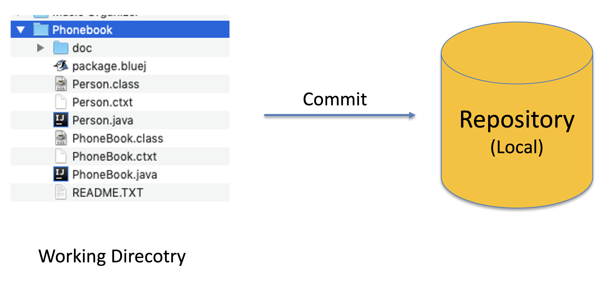
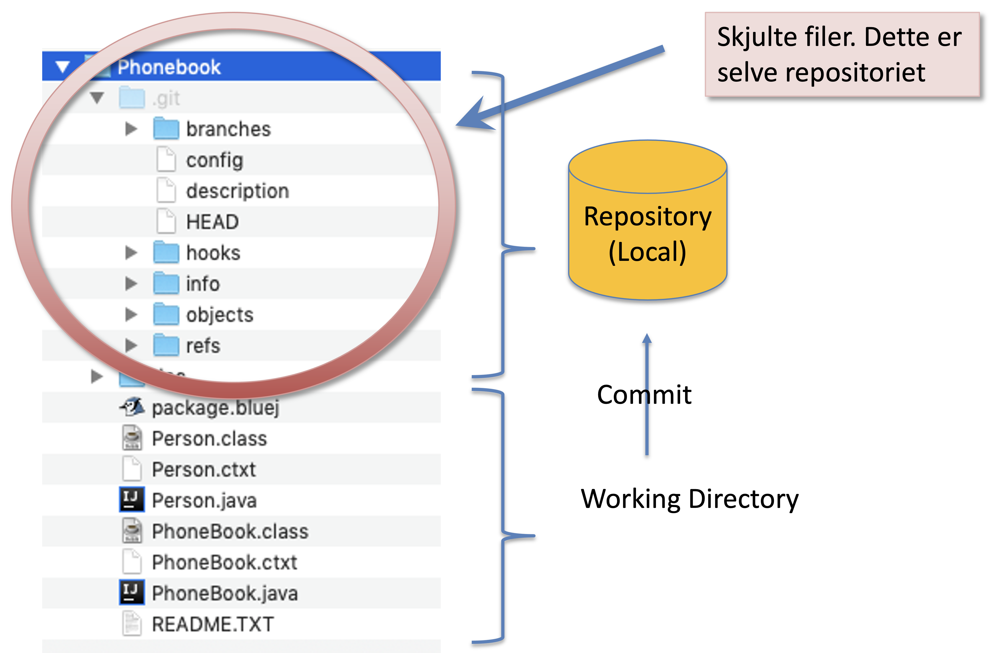
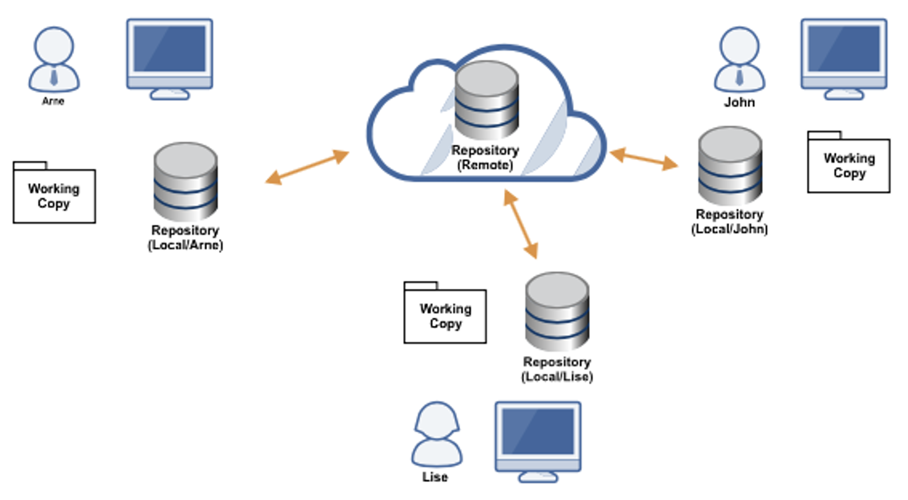
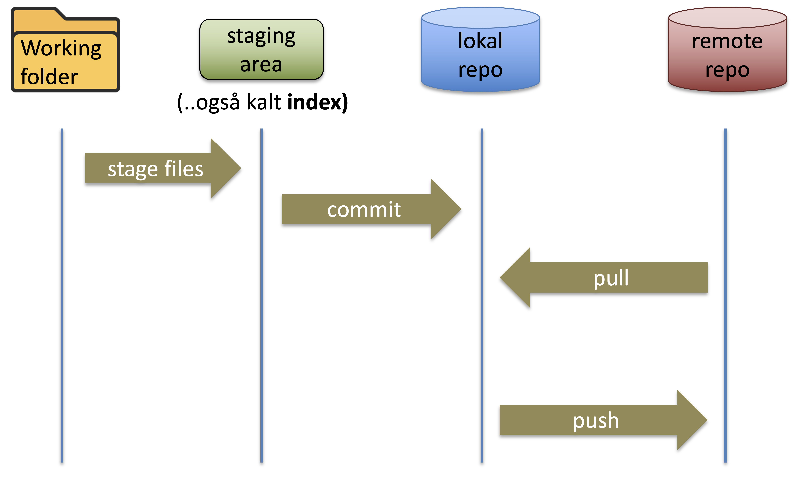

# Oppgave 1 - Vanlige kommandoer

## :bulb: Mål med Oppgave 1

Etter denne oppgaven skal du kunne å:

- Konfigurere git på egen maskin
- Lære noen av de mest brukte kommandoene i CLIen:
  - `git init` (Initialisere git-repository som spores både lokalt og på Github)
  - `git add` (Legge til filer i staging-området)
  - `git commit` (Commit'e filer til i lokalt repository)
  - `git push` (Push'e filer til remote repository)
  - `git pull` (Hente filer fra remote repository)

## 1.1 - Oppsett av git-config

:bulb: I denne seksjonen skal vi sette opp konfigurasjon som beskriver "hvem du er" i git. Du kan hoppe over denne delen om dette er noe du alt har satt opp. Om `git config --global user.name` og `git config --global user.email` returnerer ditt navn og epost-adresse, har du alt satt dette opp.

:pencil2: Konfigurer navn og epost i git-konfigurasjonen din

```
git config --global user.name "Ditt Navn"
git config --global user.email ditt.navn@epost.no
```

Erstatt `Ditt Navn` og `ditt.navn@epost.no` med ditt eget navn og epostadresse.

## 1.2 - Oppsett av standard editor

:bulb: I enkelte tilfeller trenger du en editor når du bruker Git via CLI, eksempelvis når du skal godta en merge eller skrive om commits. Avhengig av hvilket operativsystem du bruker, kan standardvalget være satt til notepad, vim eller nano. Ønsker du å bruke en annen editor, kan du konfigurere dette.

:pencil2: Konfigurer standard editor *(Valgfritt. Om du ikke vil konfigurere standard editor for git (dvs. du er fornøyd med den du alt bruker, f.eks. vim eller nano), kan du hoppe over dette steget.)*

For å konfigurere Git til å bruke Visual Studio Code som standard editor, kan du føre inn følgende kommando i terminalen din:

```
git config --global core.editor "code --wait"
```

## 1.3 - Opprett git repository
Du skal nå lage ditt første **repository**. Et Repository er et **_arkiv_** der vi kan ta vare på historikken til filene i mappen.

<div style="text-align: center; margin-top: 2rem; margin-bottom: 2rem;">
  
</div>

I praksis er dette _arkivet_ lagret i en **skjult mappe** i prosjekt-mappen din:

<div style="text-align: center; margin-top: 2rem; margin-bottom: 2rem;">
  
</div>

:pencil2: Opprett en ny tom katalog på maskinen din. (F.eks. `git-workshop-files`). Sørg for at du står i denne katalogen i terminalen din.

:pencil2: Initialiser et git repository. Dette gjør du med kommandoen `git init`.
Du vil se terminalen svare tilbake:

```
Initialized empty Git repository in /[sti til katalog]/git-workshop-files/.git/
```

## 1.4 - Første git commit

:pencil2: Legg til en fil som heter `README.md`. Legg en passende tekst i filen (Eksempel: `"Fagdag git workshop"`).

Nå skal vi lagre en kopi av filene våre til repositoriet. Typisk arbeidsprosess er som følger:

<div style="text-align: center; margin-top: 2rem; margin-bottom: 2rem;">
  
</div>

:pencil2: Sjekk status på fil med å bruke kommandoen `git status`. Her bør du se filen du la til under `Untracked files`. Dette betyr at filen ligger i filsystemet, men er ikke ennå lagt til i "staging area". 

<div style="text-align: center; margin-top: 2rem; margin-bottom: 2rem;">
  
</div>


:pencil2: Legg til filen i staging area. Dette kan du gjøre med kommandoen `git add README.md`. Sjekk på nytt status med kommandoen `git status`. 


<div style="text-align: center; margin-top: 2rem; margin-bottom: 2rem;">
  
</div>


:pencil2: Opprett en commit som inkluderer filen du har laget med kommandoen `git commit -m <melding>` Skriv en passende commit-melding (`"Initial commit"` er ofte en passende melding for første commit i et repository). 

:pencil2: Sjekk at du har en commit i commit-loggen din ved å bruke kommando `git log`.

<div style="text-align: center; margin-top: 2rem; margin-bottom: 2rem;">
  
</div>

:bulb: Du har nå opprettet et git-repository og lagt inn første commit via kommandolinjen. Bra jobba! Nå har vi alt arbeid lokalt på egen maskin, men vi ønsker gjerne å sjekke inn koden et sentralt sted.

## 1.5 - Sette eget prosjekt under versjonskontroll

Velg et prosjekt du har jobbet med på skolen. Finn frem til mappen på din harddisk der prosjektet ligger.

:pencil2: Åpne et **terminalvindu** og gå til mappen der prosjektet ditt ligger. Dette gjør du ved å skrive `cd sti-til-mappe`. Du kan også skrive `cd `i terminalvinduet, og deretter finne frem til mappen i filutforskeren din. Venstreklikk på mappen, hold musknappen nede og dra mappen over til terminal-vinduet. Da slipper du å skrive inn stien til mappen manuelt:-) 

## 1.6 - Opprett Github-repository

Github tilbyr muligheten for å oppbevare en kopi av ditt repository på en server i "skyen". Dete er nyttig og lurt for å sikre at du ikke mister filer og viktige endringer dersom datamaskinen din skulle bli ødelagt (harddisk kræsj, mistet datamaskinen i basenget el.l.). Skal du samarbeide med andre, er det svært viktig at man har et felles repository som vi holder oppdatert med koden vår.

Et typisk scenario når man jobber i team:

<div style="text-align: center; margin-top: 2rem; margin-bottom: 2rem;">
  
</div>

Arbeidsflyten utvides da som følger:

<div style="text-align: center; margin-top: 2rem; margin-bottom: 2rem;">
  
</div>

:pencil2: Opprett et Github-repository på github.com. Har du ikke en github-konto, må du opprette dette. Gå inn på din profil og velg fane "Repositories". Her vil du finne en stor grønn knapp med tittel "New"

<div style="text-align: center; margin-top: 2rem; margin-bottom: 2rem;">
  
</div>

MEN før vi går videre: Vi må generere et nøkkelsett slik at vi kan kommunisere med GitHub på en trygg måte. Du finner instruksjoner om hvordan du går frem for å lage SSH-nøkler her: [SSH-nøkler](../ssh-keys/)

Velg et passende navn under **`Repository name`** (Forslag `techschool-git-workshop`). Ikke velg noen andre innstillinger, og trykk **`Create repository`**.

Du vil komme til følgende skjermbilde, om du skal benytte deg av de nederste instruksene (**`push an existing repository from the command line`**)

<div style="text-align: center; margin-top: 2rem; margin-bottom: 2rem;">
  
</div>


Etter du har utført instruksene i Github, vil du ha:

- Satt opp ditt lokale repository til å spore et "remote repository" / "remote origin".
- Git branchen din navnet `main` (Om du sto på branch `master` blir denne nå `main`).
- Pushet endringene dine til remote origin

:pencil2: For å simulere en endring utenfor egen maskin, trykk på blyant-ikonet på github.com, og endre en fil. I terminalen din, skriv `git pull` for å hente ned siste endringer.

---

[:arrow_right: Gå til neste oppgave](../oppgave-2/README.md)
