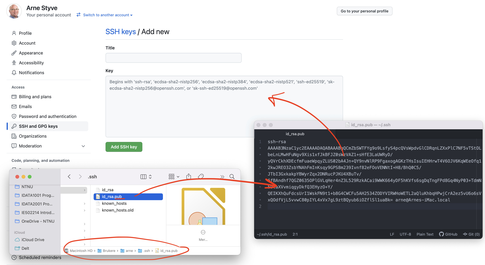

# Opprette SSH nøkler for Github

## :bulb: Mål med oppgaven
Etter denne oppgaven skal du kunne å:

- Opprette et sett SSH-nøkler (private og public)
- Legge inn din offentlige (public) nøkkel til din GitHub konto

## Opprette SSH-nøkkelsett

:pencil2: Åpne et **terminal**-vindu. Fra kommmandolinjen skriver du

`ssh-keygen`

- Ved spørsmål om filnavn (default er `ìd_rsa`), trykker du ENTER
- Ved spørsmål om _**passphrase**_ kan du enten legge inn et kort og enkelt passord, eller bare trykke ENTER for å ikke legge inn passord (strengt tatt ikke anbefalt, men greit for et kurs...)

Det har nå blitt opprettet 2 filer:
- **_id_rsa_** - som er din _private_ nøkkel. Denne må du **ALDRI** dele med noen!
- **_id_rsa.pub_** - som er din offentlige nøkkel. Det er denne du skal dele med Github f.eks.

Du finner disse filene typisk her på harddisken din:

  

Nå må du få registrert din offentlige nøkkel i din GitHub konto.

:pencil2: Åpne filen **_id_rsa.pub_** i en teksteditor (gjerne VS Code). Gå til din konto på GitHub, velg profilen din og klikk på profilbildet. Finn menyen som heter "SSH and GPG keys"

  

Kopier teksten i fra filen **_id_rsa.pub_** og lim inn i "Key"-feltet i Github. Deretter gi nøkkelen et fornuftig navn, som f.eks hvilken datamaskin nøkkelen ble generert på (iMac, MacBookPro etc)

Du er nå klar til å jobbe med GitHub :-)

